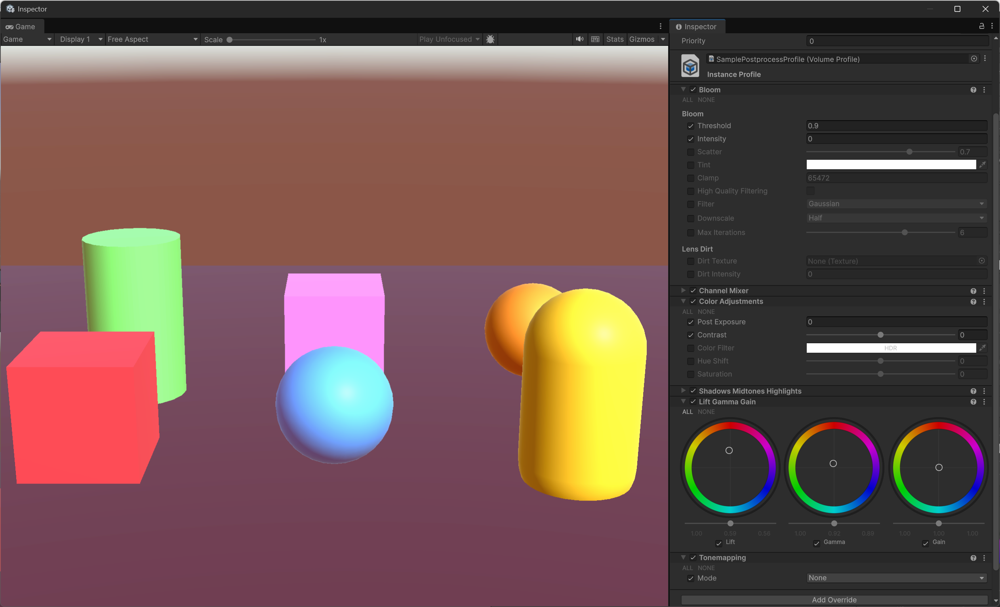
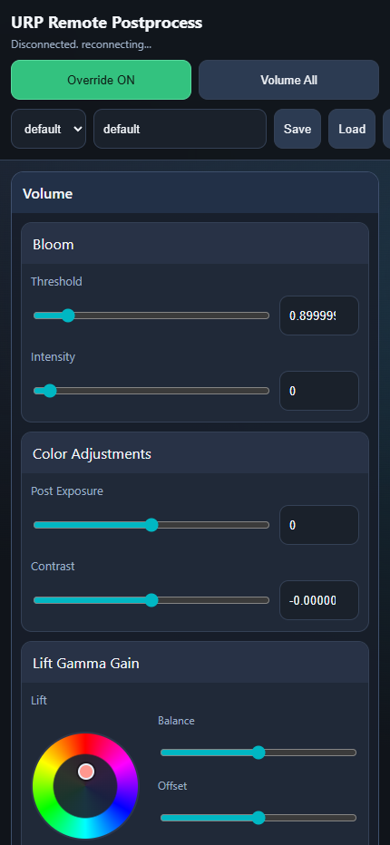
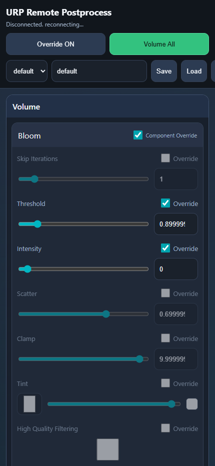

# Unity Remote Postprocessing Controller

URP の `VolumeProfile` を、Runtime 中に WebUI からリモート調整するためのプロジェクトです。  
スマホ/PC ブラウザで `localhost:8080`（または LAN 内IP）に接続し、Post Process の値を操作できます。

## 主な機能
- URP PostProcess の値を WebUI から Runtime 調整
- `Override ON` ビュー / `Volume All` ビュー切替
- Parameter Override / Component Override の ON/OFF 切替
- Preset の保存・読込・選択・Rename・Delete
- 選択中 Preset の次回起動時自動ロード
- WebSocket によるリアルタイム同期
- Tonemapping / Channel Mixer / LiftGammaGain / ShadowsMidtonesHighlights の Inspector 寄せUI
- EditMode で Preset 値を現在 Profile に反映

## 動作環境
- Unity 6（6000系）
- URP（`com.unity.render-pipelines.universal`）

## セットアップ
1. シーンに `RemotePostprocessController` を追加
2. `Target Volumes` に操作対象の `Volume` を設定
3. Play 実行
4. ブラウザで `http://localhost:8080/` を開く

## Unity Package Manager から導入
GitHub リポジトリ:
- `https://github.com/sugi-cho/UnityRemotePostprocessingController`

このリポジトリは Unity プロジェクト構成のため、UPM では `path` 指定でパッケージを参照します。

Package Manager UI から追加:
1. Unity メニュー `Window > Package Manager` を開く
2. `+` ボタンから `Add package from git URL...` を選択
3. 次を入力

`https://github.com/sugi-cho/UnityRemotePostprocessingController.git?path=/Packages/cc.sugi.urp-remote-postprocess`

`Packages/manifest.json` に直接追記する場合:
```json
{
  "dependencies": {
    "cc.sugi.urp-remote-postprocess": "https://github.com/sugi-cho/UnityRemotePostprocessingController.git?path=/Packages/cc.sugi.urp-remote-postprocess"
  }
}
```

特定バージョン固定（タグ利用）例:
- `https://github.com/sugi-cho/UnityRemotePostprocessingController.git?path=/Packages/cc.sugi.urp-remote-postprocess#v0.1.0`

スマホから接続する場合:
- `http://<PCのIP>:8080/` にアクセス
- 必要に応じて Windows の URLACL/Firewall 設定を許可

## クイックスタート
1. Unity でシーンを開く
2. `RemotePostprocessController` の `Target Volumes` を設定
3. Play 実行
4. ブラウザで `http://localhost:8080/` を開く
5. `Override ON` / `Volume All` を切り替えて調整
6. Preset を `Save` して次回起動時に自動ロードを確認

このツールは、Unity であらかじめ設定した `VolumeProfile` をベースに、Play中に WebUI から値を変更できます。  
WebUI でスライダーやトグルを操作すると `PATCH /state` が送信され、`RemotePostprocessController` が対象 `Volume` の Postprocess パラメータへ即時適用します。  
そのため、ゲームビュー/シーンビューの見た目がその場で変化し、調整結果をリアルタイムに確認できます。

### 例:
*Unity Inspector 側の Tonemapping（Mode選択）表示例*

| Override On | Volume All |
| -- | -- |
|  |  |
|   Override が有効な項目のみを表示<br>Component Override が OFF のコンポーネントは非表示 | 全項目を表示<br>各パラメータの Override と Component Override を変更可能 |

## Preset 運用
- Save:
  - 入力名が既存なら上書き
  - 新規名なら新規作成
- Load:
  - 選択中 Preset を読み込み
- Rename:
  - 選択中 Preset を入力名へ改名
- Delete:
  - 選択中 Preset を削除
- 自動ロード:
  - 最後に選択された Preset を次回起動時に自動ロード

## Preset 保存先
`Application.persistentDataPath/RemotePostprocess/presets/*.json`

Windows 例:
`C:\Users\<User>\AppData\LocalLow\DefaultCompany\UnityRemotePostprocessingController\RemotePostprocess\presets\`

## EditMode 反映
`RemotePostprocessController` の Inspector から:
- `Apply Selected Preset To Current Profile`

選択中 Preset の値を現在の `VolumeProfile` に反映し、`AssetDatabase.SaveAssets()` まで実行します。

## API（主要）
- `GET /health`
- `GET /schema`
- `GET /state`
- `PATCH /state`
- `GET /presets`
- `POST /presets/save`
- `POST /presets/load`
- `POST /presets/select`
- `POST /presets/rename`
- `POST /presets/delete`
- `GET /ws`（WebSocket）

## トラブルシュート
- `internal_error` が出る:
  - Unity Console の `[URP Remote PP] Request handling error` を確認
  - Play を再起動し、ブラウザをハードリロード
- 接続が `Disconnected. reconnecting...` のまま:
  - `http://localhost:8080/health` が `{"ok":true}` か確認
  - ポート競合や Firewall 設定を確認
